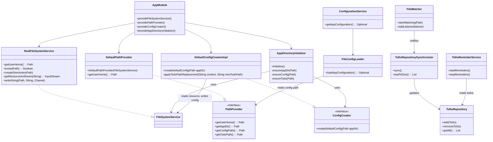
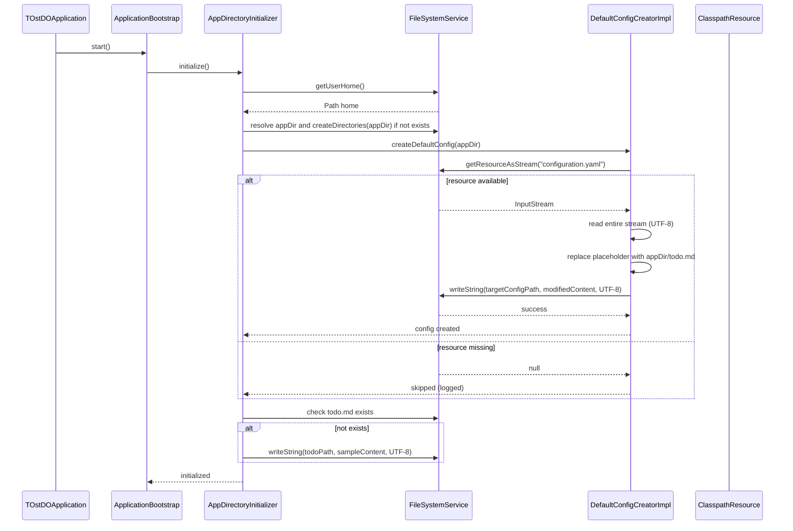
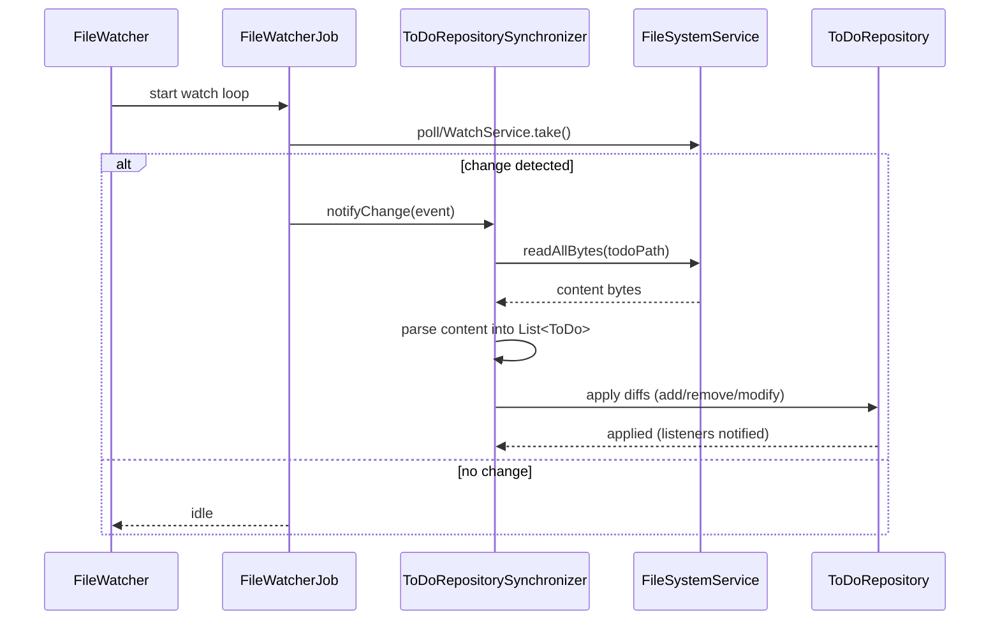

# Technical Documentation — TOstDO

This document describes the project architecture, main modules, dependencies, how to run and test the application, and developer guidance.

Checklist
- [x] Translate the existing Polish documentation into English
- [x] Add a high-level architecture diagram (Mermaid)
- [x] Add a startup sequence diagram (Mermaid)
- [x] Keep developer guidance and run/test instructions

---

## Table of Contents
- [Architecture](#architecture)
- [Key Components](#key-components)
- [Configuration and Formats](#configuration-and-formats)
- [Startup Sequence (diagram)](#startup-sequence-diagram)
- [How to run the application](#how-to-run-the-application)
- [Tests and CI](#tests-and-ci)
- [Developer guidance](#developer-guidance)
- [Development tasks and extensions](#development-tasks-and-extensions)

## Architecture
TOstDO is a lightweight desktop TODO manager written in Java. The project emphasizes modularity and testability. Main layers and responsibilities:

- Bootstrap layer — initializes application directory and default files (`AppDirectoryInitializer`, `ConfigCreator`).
- Configuration layer — loads configuration from file(s) and classpath (`FileConfigLoader`, `ClasspathConfigLoader`).
- Model layer — repository for TODO items (`ToDoRepository`) and a synchronizer that keeps repository and TODO file in sync (`ToDoRepositorySynchronizer`).
- Reminder layer — reminder scheduling and delivery (`ToDoReminderService`).
- System integration layer — tray integration and notifications (`TrayService`, notification senders).

Dependency injection is handled by Guice via `AppModule`.

### Architecture overview (diagram)
```mermaid
flowchart LR
  subgraph App
    A[TOstDOApplication]
    B[AppModule (Guice)]
    C[ApplicationAssembler]
    D[ApplicationBootstrap]
  end

  subgraph Bootstrap
    E[AppDirectoryInitializer]
    F[ConfigCreator (DefaultConfigCreatorImpl)]
    G[FileSystemService (RealFileSystemService)]
    H[PathProvider (DefaultPathProvider)]
  end

  subgraph Config
    I[FileConfigLoader]
    J[ClasspathConfigLoader]
    K[ConfigurationService]
  end

  subgraph Model
    L[ToDoRepository]
    M[ToDoRepositorySynchronizer]
  end

  subgraph Reminder
    N[ToDoReminderService]
  end

  A --> B
  B --> C
  C --> D
  D --> E
  E --> F
  E --> G
  F --> G
  F --> H
  C --> K
  K --> I
  K --> J
  K --> L
  L --> M
  L --> N
  M --> L
```

## Key Components
- `FileSystemService` — an abstraction for file system operations; production implementation is `RealFileSystemService`.
- `PathProvider` — provides canonical locations used by the app (user home, app directory, config file, todo file). This isolates calls to `System.getProperty("user.home")` and centralizes path logic.
- `ConfigCreator` (`DefaultConfigCreatorImpl`) — creates a default `config.yaml` from bundled resources and injects the actual `todo.md` path.
- `FileConfigLoader` / `ClasspathConfigLoader` — two `ConfigSource` implementations: one reads config from disk (using `PathProvider`), the other from classpath resources.
- `AppDirectoryInitializer` — ensures the application directory and default files exist.
- `AppModule` — Guice module that wires the production implementations (e.g. `RealFileSystemService`, `DefaultPathProvider`, `DefaultConfigCreatorImpl`).

## Configuration and formats
See `CONFIGURATION.md` for detailed `configuration.yaml` structure and mapping to Java classes (`AppConfiguration` -> `ReaderConfiguration` -> `TodoItemConfiguration`, `ReminderConfiguration`, etc.).

## Startup sequence (diagram)
This sequence shows simplified steps that occur during application startup and bootstrapping.

```mermaid
sequenceDiagram
    participant App as TOstDOApplication
    participant BootstrapInjector as Guice(BootstrapModule)
    participant Bootstrap as AppDirectoryInitializer
    participant ConfigCreator as DefaultConfigCreatorImpl
    participant FS as FileSystemService
    participant ConfigLoader as FileConfigLoader
    participant ConfigSvc as ConfigurationService
    participant Guice2 as Guice/AppModule
    participant Assembler as ApplicationAssembler
    participant Bootstrapper as ApplicationBootstrap

    %% New flow: bootstrap (creates default config) runs before loading AppConfiguration
    App->>BootstrapInjector: Create injector (BootstrapModule)
    BootstrapInjector->>Bootstrap: Provide AppDirectoryInitializer
    BootstrapInjector->>Bootstrap: call perform()  %% previously a static helper was used here; now bootstrap uses DI
    Bootstrap->>FS: getUserHome()
    Bootstrap->>FS: create app dir if missing
    Bootstrap->>ConfigCreator: createDefaultConfig(appDir)
    ConfigCreator->>FS: read bundled configuration resource
    ConfigCreator->>FS: write config.yaml
    Bootstrap->>FS: create sample todo.md

    App->>ConfigSvc: getAppConfiguration()
    ConfigSvc->>ConfigLoader: FileConfigLoader.loadAppConfiguration()
    ConfigLoader->>FS: read config.yaml
    ConfigSvc-->>App: AppConfiguration

    App->>Guice2: Create injector (AppModule) with AppConfiguration
    Guice2->>Assembler: Provide ApplicationAssembler
    App->>Bootstrapper: Start bootstrap (get ApplicationBootstrap)
    Bootstrapper->>Assembler: run application
```

## How to run the application
- From your IDE: run `pl.catchex.TOstDOApplication.main()`.
- From command line (packaged jar):

  Build:
  ```bash
  mvn -DskipTests=false package
  ```

  Run:
  ```bash
  java -jar target/TOstDO-0.0.1-SNAPSHOT.jar
  ```

Note: On first run the application creates an application directory (for example `~/.TOstDO`), copies a default `config.yaml` (if present in resources), and creates a sample `todo.md` file.

## Tests and CI
- Unit tests: JUnit 5 and Mockito, executed with Maven:

```bash
mvn -DskipTests=false test
```

- Recommendations for CI:
  - Run `mvn -DskipTests=false test` in CI pipelines (GitHub Actions / other).
  - Use `@TempDir` or an in-memory file system (e.g. `jimfs`) to isolate tests touching the filesystem.

## Developer guidance
- Prefer dependency injection: inject `FileSystemService`, `PathProvider`, and `ConfigCreator` instead of calling static helpers.
- Keep POJOs used by SnakeYAML with a public no-arg constructor.
- When updating configuration structure, update `CONFIGURATION.md` and add parsing tests.
- Use `AppModule` to register production implementations; for unit tests either construct classes with mocks or create a test Guice module.
- Log important events and errors using the logging framework (SLF4J with Logback).

## Class diagram (detailed)
A simplified class-level diagram showing main classes, important methods and relationships. This is not a full UML model but helps quickly understand responsibilities and dependencies.



## Detailed sequences
Below are two expanded sequence diagrams showing more detailed interactions.

### 1) Detailed: default configuration creation
This flow expands how `AppDirectoryInitializer` and `DefaultConfigCreatorImpl` interact with the `FileSystemService` to create the default `config.yaml` and `todo.md`.



### 2) Detailed: ToDo file change synchronization
This diagram explains how file system changes are observed and synchronized into the `ToDoRepository`.



---

If you'd like, I can also generate a Mermaid class diagram file (`docs/diagrams/class-diagram.mmd`) and separate sequence diagram files for inclusion in documentation sites. Let me know your preferred output format (Markdown-only, `.mmd` files, or images rendered via CI).
